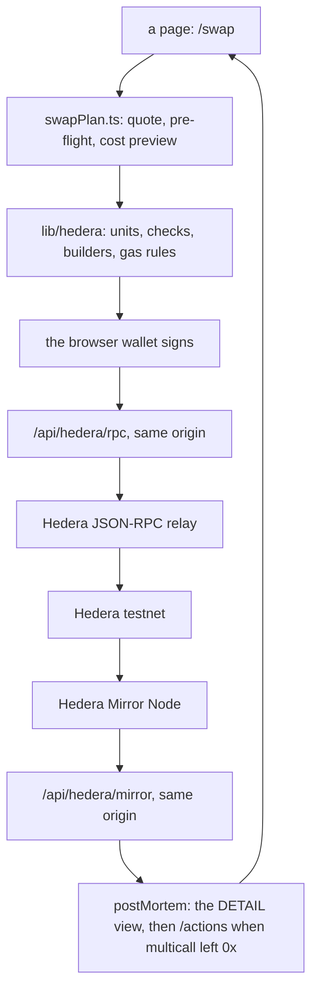

# Swap and manage liquidity on SaucerSwap V2, from a Hedera dApp

On Hedera a swap can pass `eth_call`, `eth_estimateGas` and the mirror node's own simulator and still be rejected by the network, which keeps the gas. The wallet has nothing to warn about, because every simulator it can ask said yes: it showed a fee, a Confirm button and nothing else. One such swap on 22 September 2026 burnt [0.13498778 HBAR](https://hashscan.io/testnet/tx/0xdf368443228e69c4ed1a2a7192d0978b15a51f219981cdd2d5f63250d1582352), delivered nothing, and left a MetaMask history that says "Interaction failed" and nothing more.

This is a Scaffold-HBAR template — Next.js, wagmi and Hardhat — whose swap path knows what the simulators do not. It refuses, before the wallet opens, what the network would refuse after taking the gas; it decodes the failures that happen anyway into one sentence and one action; it carries gas limits for the calls no simulator will price; and it puts a testnet transaction you can open behind every figure it quotes. On that path you swap HBAR for an HTS token and back on SaucerSwap V2 — from the Swap page, from a script, and from your own Solidity contract — and open, read and close a V2 liquidity position from a script, with the Positions page reading it back.

## One command

```bash
npx create-scaffold-hbar@latest my-app --template frytegg/scaffold-hbar-saucerswap-v2 -s hardhat
```

That command asks what to install before it starts. Where nothing can answer it — a script, a container, any shell without a terminal attached — add `--yes`, which accepts every default:

```bash
npx create-scaffold-hbar@latest my-app --template frytegg/scaffold-hbar-saucerswap-v2 -s hardhat --yes
```

```bash
cd my-app
yarn dev
```

The app answers on `http://localhost:3000` with no env file, no key and no account. `/swap` and `/positions` load without asking the network for anything, and every read and write they make afterwards leaves from the app's own origin. The first page requested compiles while it loads, which takes a minute or two and shows nothing meanwhile; every page after that is immediate.

With no wallet connected, `/swap` offers one button that runs the quote and the whole pre-flight against a fixed testnet account and shows what the network answers for it today. That is the argument of this template, watched rather than read, and it needs no wallet, no key and no HBAR.

## Verify it yourself

Four ways in. The first three are short and ask for no key, no wallet and no account of yours: one replays the failures themselves from the answers captured when they happened and touches no network at all, one falsifies those captured answers to show the sentences are computed rather than written, and the third puts the same checks on an account you name. The third re-runs every proof this repository makes, against the tests, against the tree and against the public mirror node. Start with the first — it is the argument of this template in one screen.

### The first one: three failures, replayed offline

```bash
yarn replay
```

It replays three of the failures below from the answers captured when they happened: the swap every simulator accepted and the network refused, the call no wallet can price, and the response code hiding inside a successful transaction. For each one it prints what a developer's own tools reported, what this template says instead, and the transaction it comes from.

Every sentence it shows in quotes is produced by the library while the command runs, from the captured answer printed above it, so what you read is what the app would have shown, and the command fails instead of printing when a captured answer stops producing the refusal it is shown for. The answers themselves are the committed files of `packages/nextjs/lib/hedera/__tests__/fixtures/`, and nothing leaves the process: `packages/nextjs/lib/hedera/__tests__/replayCaptured.test.ts` asserts that against a global `fetch` that throws.

### The second one: break the evidence, and watch the sentences follow

```bash
yarn tamper
```

The command above prints sentences and claims the library computed every one of them from the captured answer
beside it. A reader cannot check that by reading, because a hardcoded sentence and a computed one look the same
on a screen. So this command breaks the data on purpose.

It takes three captured answers, alters one field in each and runs the same library function over both versions:
the response code inside a successful transaction goes from 194 to 22, the code hidden in a reverted swap's
`/actions` goes from 292 to 184, and the status that makes a call un-priceable stops saying `INVALID_NFT_ID`.
Each time, it prints what the library said before and what it says now. The verdict flips from fail to pass, the
action changes from `approve` to `associate`, and the advice to supply a gas limit disappears with the reason
for it.

Every alteration is made to a copy held in memory. The files are read twice and their digests compared, so the
report can say that nothing on disk moved. The command exits 1 if any sentence survives its own evidence being
falsified, because a sentence that does not follow its data was written by hand.

### The third one: the same checks, on an account you name

```bash
yarn preflight
```

The command above replays answers this repository captured. This one answers about an account you choose: it asks for one — an EVM address (`0x…`) or a Hedera account id (`0.0.…`) — reads it on Hedera's public mirror node and its JSON-RPC relay, and prints three things about it. Whether a swap can pay it SAUCE, which is `recipientVerdict`. Whether the router may spend that account's SAUCE, which is `checkAllowance`. And what the call no simulator prices would cost at today's gas price, which is the gas rule and `checkCost`. They are the same verdicts, in the same sentences and with the same actions, that a page shows for the address a wallet connects. Nothing is signed and no key is read, and it prints the mirror URLs it read for you to open yourself.

It asks on standard input rather than taking the account after the command, because a project scaffolded for the other package manager forwards what follows a script name only for a few names this one is not among, and the account would be dropped there and kept here. A question behaves the same under both. Pass one anyway and it says so before it asks, naming what you passed: an input given and silently discarded is the mistake this whole template is about.

It reads two third-party endpoints, which is why it is not part of `yarn check:all`, and it says which of two different things happened rather than guessing between them. It exits 0 when it printed a verdict, 1 when what you typed is neither an address nor an account id, 2 when the mirror node or the relay did not answer, and 3 for anything else. An endpoint that is down is reported as an endpoint that is down, never as an answer about the account.

### The whole thing, in three more commands

| command | what it proves |
| --- | --- |
| `yarn test:unit` | the library, the two relay routes and everything the pages decide, replayed against answers captured from Hedera testnet and from a browser wallet. Every refusal named below has a test that states it as a rule. No network |
| `yarn check:docs` | every path, link, script, symbol and variable this file names exists in the repository; every figure below is the one its evidence record holds; the tree survives the CLI's rewrite for the other package manager. It fetches the published CLI |
| `yarn evidence:check` | re-reads every record of `docs/evidence/` from the mirror node: the result, the sender, the block, the gas, the fee taken from the transfer list, and the amount each swap returned. Reads the public mirror node |

Three to four minutes for all three the first time, most of it the first command, which replays the lint rule against a file of planted violations. What they take depends on the machine and on what is already cached: on Windows 11 with Node 24.13.0, on 23 September 2026, they took 155, 57 and 37 seconds in a project scaffolded that morning, and 105, 32 and 39 on a warm checkout of the same machine, where a later run of the first command took 29. The offline command above was timed separately, in a project scaffolded the same evening: 43 seconds on its first run there, straight after the install, and 4 to 5 seconds on every run after it. These are one machine's wall-clock readings, not a promise about yours.

Then open the transactions themselves. Each was signed by this template's own code, on Hedera testnet, chain 296; the mirror link is the machine-readable one, Hashscan renders the same transaction for a person.

| what was signed | transaction | record |
| --- | --- | --- |
| swap 0.1 HBAR for SAUCE | [0x25c637ca…3bfb](https://hashscan.io/testnet/tx/0x25c637ca7b28b39cb9964247d69cba2152b0e3d9aea07aa6303d107ed6093bfb) ([mirror](https://testnet.mirrornode.hedera.com/api/v1/contracts/results/0x25c637ca7b28b39cb9964247d69cba2152b0e3d9aea07aa6303d107ed6093bfb)) | `docs/evidence/2026-09-22-hbar-to-sauce.json` |
| swap 1 SAUCE back to native HBAR, one transaction, no wrapped token left behind | [0x71c08eab…3b20](https://hashscan.io/testnet/tx/0x71c08eabf61768476cd33a9c2b44c38a1b34d44406bdd66acbde85ecfafd3b20) ([mirror](https://testnet.mirrornode.hedera.com/api/v1/contracts/results/0x71c08eabf61768476cd33a9c2b44c38a1b34d44406bdd66acbde85ecfafd3b20)) | `docs/evidence/2026-09-22-sauce-to-hbar.json` |
| deploy the Solidity consumer, which associates itself with its output token in its constructor | [0x94f6173b…3e24](https://hashscan.io/testnet/tx/0x94f6173b6e86e84a2b7b22ffe9d2fd93636f111c53a5a298cb2d92d138783e24) ([mirror](https://testnet.mirrornode.hedera.com/api/v1/contracts/results/0x94f6173b6e86e84a2b7b22ffe9d2fd93636f111c53a5a298cb2d92d138783e24)) | `docs/evidence/2026-09-22-consumer-hbar-to-sauce.json` |
| the same swap sent to that contract instead of to the router | [0xfe12a2e3…3e87](https://hashscan.io/testnet/tx/0xfe12a2e32ea5157de9465af9a82de112c4d4adc2c8a729a07e2958481a5f3e87) ([mirror](https://testnet.mirrornode.hedera.com/api/v1/contracts/results/0xfe12a2e32ea5157de9465af9a82de112c4d4adc2c8a729a07e2958481a5f3e87)) | the same record |
| open a liquidity position, the call both simulators refuse to price | [0xac5b0609…d017](https://hashscan.io/testnet/tx/0xac5b06097841d492cad222545bd01eddc837099040bd1d5e5bb3abfd1e85d017) ([mirror](https://testnet.mirrornode.hedera.com/api/v1/contracts/results/0xac5b06097841d492cad222545bd01eddc837099040bd1d5e5bb3abfd1e85d017)) | `docs/evidence/2026-09-23-position-cycle-361.json` |
| empty it and take the payout as native HBAR, not as a wrapped token | [0xaa50b98a…0cf8](https://hashscan.io/testnet/tx/0xaa50b98ad3f2fced5548b30142a6314d93fd141517018185158bd6bda77b0cf8) ([mirror](https://testnet.mirrornode.hedera.com/api/v1/contracts/results/0xaa50b98ad3f2fced5548b30142a6314d93fd141517018185158bd6bda77b0cf8)) | the same record |
| the same life cycle from an account created 21 seconds before this mint | [0x7fb2cd0b…2353](https://hashscan.io/testnet/tx/0x7fb2cd0b65a60d9657cc162b84cb58017d333047a3becddbbbe5ce65968a2353) ([mirror](https://testnet.mirrornode.hedera.com/api/v1/contracts/results/0x7fb2cd0b65a60d9657cc162b84cb58017d333047a3becddbbbe5ce65968a2353)) | `docs/evidence/2026-09-23-position-cycle-362.json` |

The Solidity consumer of the third and fourth rows can be read as source, not only as a transaction: Sourcify holds it as an [exact match on both the creation and the runtime bytecode](https://sourcify.dev/server/v2/contract/296/0x7E1a4337BEBB0cC8e231c6137Da17F04C7cd3409), verified on 22 September 2026 and re-read keylessly on the 23rd, and Hashscan renders the same contract at [0.0.10671897](https://hashscan.io/testnet/contract/0.0.10671897). `yarn hardhat:verify:testnet` is what submits it, through `packages/hardhat/scripts/verifySourcify.ts`, which exists because the verification endpoints the inherited task calls were removed.

Each record also carries the versions it ran on, what every pre-flight check answered before the send, and the sender's net HBAR movement. With a funded testnet key in the shell, `yarn evidence` signs the swap scenarios again and `yarn evidence:position` a whole life cycle; without one, both exit 0 and say they were skipped.

## Nine things the network does that your tools report wrongly, or not at all

Each has its own section in [`docs/hedera-behaviour.md`](docs/hedera-behaviour.md), with the transactions that prove it, what the mistake costs in HBAR, the code that refuses it and the test that keeps that code honest. If you arrived here holding an error string rather than a question, [`docs/troubleshooting.md`](docs/troubleshooting.md) is keyed by the string itself — including the three custom errors that have no name attached to them anywhere: `0xffb9e6ed`, `0xace7dae0` and `0xa9688682`.

**[The simulators approve a swap the network refuses](docs/hedera-behaviour.md#the-simulators-approve-a-swap-the-network-refuses).** An HTS allowance is held below the EVM, so `eth_call`, `eth_estimateGas` and the mirror node's simulator all accept a token-input swap the network then rejects with `SPENDER_DOES_NOT_HAVE_ALLOWANCE`. You get one keyless read before the send, `allowanceVerdict`, that refuses it and names the amount to approve — and a live check that fails the day the simulators stop being wrong.

**[Some calls cannot be priced, and the wallet then cannot send them](docs/hedera-behaviour.md#some-calls-cannot-be-priced-and-the-wallet-then-cannot-send-them).** Opening a V2 position is refused by both simulators with `INVALID_NFT_ID` although the network executes it, so a wallet shows "network fee unavailable" and the send fails. A dApp that lets the wallet estimate cannot open a position on Hedera today. You get `packages/nextjs/lib/hedera/gasRules.ts`: today one rule, for the position mint, with the executed transactions its limit is derived from and a builder that refuses to produce such a call without one.

**[The wallet prices the gas limit; the network charges the gas used](docs/hedera-behaviour.md#the-wallet-prices-the-gas-limit-the-network-charges-the-gas-used).** Over eight measured transactions the fee announced before the signature was larger than the fee charged every single time, by up to eight times. You get a cost preview of your own, always said as "up to", and `WALLET_FEE_NOTE`, the one sentence that explains the wallet's figure instead of arguing with it.

**[Emptying a position pays a wrapped token, unless the call is split in three](docs/hedera-behaviour.md#emptying-a-position-pays-a-wrapped-token-unless-the-call-is-split-in-three).** The pattern a Uniswap reader writes first reverts and the documented pattern leaves the user holding wrapped HBAR — both at simulation level and against original mocks; the split that works has closed six positions on testnet. You get `buildSplitCollect`, which builds the three calls in the order that paid native HBAR on those six, refuses a floor of zero on a sweep, and is checked afterwards against the sender's own transfer list.

**[A burn the simulators accept, and the network refuses](docs/hedera-behaviour.md#a-burn-the-simulators-accept-and-the-network-refuses).** Closing a position needs `setApprovalForAll` on the position NFT, which is checked at consensus and not during a simulation. You get `buildBurn`, which will not build the call while the manager holds no approval, and `buildNftApproval`, which is the remedy.

**[HBAR has two units, and the wrong one fails under another name](docs/hedera-behaviour.md#hbar-has-two-units-and-the-wrong-one-fails-under-another-name).** Inside the EVM every amount is tinybar; a transaction's `value` is weibar, 10^10 times larger. Write the calldata figure in both and a default viem flow dies with `INSUFFICIENT_TOKEN_BALANCE` — a message about a token balance for a mistake about HBAR. You get two branded types, one door (`payable`) from one to the other, and a lint rule that fails `yarn lint:strict` on a transaction `value:` written outside that module.

**[A token cannot reach an account that has never held it](docs/hedera-behaviour.md#a-token-cannot-reach-an-account-that-has-never-held-it-and-who-that-actually-bites).** The token service refuses a transfer to an account with no relation and no free automatic-association slot; the swap reverts and is charged anyway. You get `recipientVerdict`, which reads the recipient on the mirror node and answers one of six things — including the two cases a wallet cannot see, a recipient that is not the sender and an account whose slot budget the mirror node does not count.

**[An account can have two addresses, and only one of them can receive a token](docs/hedera-behaviour.md#an-account-can-have-two-addresses-and-only-one-of-them-can-receive-a-token).** An account born from an ECDSA key answers to the long-zero form of its id and to an `evm_address` of its own; pay a token to the first and the token service refuses it with `INVALID_ALIAS_KEY`, the same custom error as the association failure above with 282 inside it instead of 184, so the two look alike and want opposite things. You get that comparison inside `recipientVerdict`, before it looks at associations at all, and one transaction of ours that proves the difference: the same account, the same pool, the same direction, one address form apart.

**[A failed HTS operation can be a successful transaction](docs/hedera-behaviour.md#a-failed-hts-operation-can-be-a-successful-transaction).** The token service answers a response code rather than reverting, so a refused association is a `SUCCESS` with a green tick and a full fee. You get `facadeResultVerdict` and `explainResponseCode` in TypeScript, and a Solidity consumer whose constructor accepts code 22 and nothing else, so a contract that cannot hold its own output token never gets an address.

## Take either one away

**Without Hedera there is no subject.** Every one of the nine behaviours above is a property of this network:
the token service answering a response code where the EVM would revert, an allowance held below the EVM where
no simulator can see it, two units for one currency across the JSON-RPC boundary, an account with two address
forms of which only one can receive a token, a call the relay will not price. None of them exists on a chain
where the EVM is the whole ledger. Move this template to one and the library has nothing left to check.

**Without SaucerSwap there is no template.** The quote, the swap both ways, the position life cycle and the
Solidity consumer are calls into its router, its quoter and its position manager. Remove it and what remains
is a Scaffold-HBAR starter with an empty `lib/`: the pages have nothing to call, the evidence records have
nothing to record, and seven of the nine behaviours were found by calling its contracts and reading what came
back.

That is the test this template was built to pass, and it is the reason the integration is not an SDK imported
once to tick a box: **the failures documented here are the failures of using that protocol on this network,
and neither half of the sentence is removable.**

## What you get


*The refusal this template exists for, on `/swap` with no wallet, no key and no account. The verdict is `allowanceVerdict` in `packages/nextjs/lib/hedera/preflight.ts`, reached through `packages/nextjs/components/swap/SampleRunCard.tsx`; the reason and the action are what the connected panel shows for your own address. Taken on 23 September 2026 by `yarn shots`, which serves this repository's own production build on port 3210 and drives Chromium through the page, so the verdict in the picture is what Hedera testnet answered that day and not a drawing of one. That command re-takes it, and fails instead of writing the file when the panel stops saying what this caption says it says: `tools/route-probe/src/shots.mjs` holds both.*

| Piece | What it does |
| --- | --- |
| `/swap` | a SaucerSwap V2 swap both ways: the account read from the mirror node, a quote on user action, one line per check the network would otherwise answer only after taking the gas, a cost preview, the send, and the outcome read back from the mirror node's DETAIL view. With no wallet connected it offers the same quote and the same checks against a fixed testnet account instead, so the refusals can be read without installing anything |
| `/positions` | the connected account's V2 positions, read-only: the range against the pool's live tick, what closing one would return, and both links per serial |
| `/debug` | the stock Debug Contracts page: it reads and writes the contracts deployed for the network the wallet is on, which on Hedera testnet is this template's own consumer and nothing else |
| `packages/nextjs/lib/hedera/` | what the pages, the scripts and the tests share: the two units, the address book, original ABIs, error decoding, the mirror client, the pre-send checks, the swap and position builders, the gas rules — [`docs/use-the-checks-in-your-app.md`](docs/use-the-checks-in-your-app.md) is the one-line call and the sentence each of them answers |
| `packages/hardhat/contracts/SaucerSwapHbarConsumer.sol` | a contract that swaps the HBAR sent with a call for an HTS token and keeps it; it associates itself in its constructor, so the deployer pays for that relation once instead of every swap paying for it |
| `yarn test:unit` and `yarn test:mock` | the two offline tiers: captured testnet answers replayed through the pinned viem, and the contract against original mocks injected at the real addresses, which reproduce the response codes and the empty reverts a fork cannot |
| `yarn test` and `yarn probe:routes` | the inherited samples on a fork of Hedera testnet, and every page route loaded in Chromium in three network modes with zero console errors and zero third-party requests |
| `yarn check:live` | keyless reads that re-assert the address book, a quote, and the dated observation that three simulators still accept a swap with no allowance |
| `.github/workflows/gate.yml` | scaffolds this checkout through the published CLI, on every push to `main` that changes more than Markdown and again nightly, installs the result, and runs lint, types, build, tests, the route probe, the docs checks and a secret scan of the tree and the history inside the scaffolded project |

## Architecture

The write path, from a page to the network and back.



Nothing in the browser talks to a third party. Those route handlers, and the account lookup beside them, answer HTTP 200 with a typed error body when the public endpoints behind them fail, because a browser logs every response of 400 or more as a console error — and `yarn probe:routes` fails a route on any console error and on any request to a host that is not the app's own.

| Path | What |
| --- | --- |
| `packages/nextjs/app/` | the routes `/`, `/swap`, `/positions`, `/debug`, and the three handlers under `packages/nextjs/app/api/hedera/` |
| `packages/nextjs/components/swap/` | the swap panel; `swapPlan.ts` takes its reads as an argument, so every refusal it can show is tested without a network |
| `packages/nextjs/components/positions/` | the positions list, built the same way |
| `packages/nextjs/components/hedera/` | what both routes share: the failure note, the words for the action to take, the two links, and `withRuleGasLimit`, the one door from a page to the gas rules |
| `packages/nextjs/lib/hedera/` | the Hedera-specific library; `index.ts` is its public surface, which [`docs/use-the-checks-in-your-app.md`](docs/use-the-checks-in-your-app.md) calls with no page, no wagmi hook and no component of this template, and `__live__/` holds the keyless and signed tiers |
| `packages/hardhat/contracts/` | the consumer, its own minimal interfaces, the mocks the offline tier injects, and the inherited samples |
| `docs/evidence/` | one JSON record per signed scenario, re-read by `yarn evidence:check` |
| `docs/hedera-behaviour.md` | the nine sections above, in full |
| `docs/troubleshooting.md` | the same failures keyed by the exact string a tool printed, each one captured in a file the entry names |
| `tools/checks/` | the repository checks behind `yarn check:docs` |
| `tools/gate/` and `tools/route-probe/` | the scaffold gate, and the browser probe as a standalone package so that no install of the app downloads a browser; `yarn shots` is the same package taking the picture above |

## Environment variables

Nothing needs to be set: the app, the build and the tests run with no env file. Each variable goes in the file named below; a scaffolded project also gets a root `.env.example` listing them, but no package reads env files at the root.

| Variable | File | Required | Default | Read by |
| --- | --- | --- | --- | --- |
| `NEXT_PUBLIC_WALLET_CONNECT_PROJECT_ID` | `packages/nextjs/.env.local` | no | empty: WalletConnect is off, browser-injected and burner wallets are offered | `packages/nextjs/scaffold.config.ts` |
| `HEDERA_RPC_TESTNET_URL` | `packages/nextjs/.env.local` | no | `https://testnet.hashio.io/api` | the `/api/hedera/rpc` relay, on the server |
| `HEDERA_RPC_MAINNET_URL` | `packages/nextjs/.env.local` | no | `https://mainnet.hashio.io/api` | the same relay, for mainnet |
| `HEDERA_MIRROR_TESTNET_URL` | `packages/nextjs/.env.local` | no | `https://testnet.mirrornode.hedera.com` | the `/api/hedera/account` and `/api/hedera/mirror` routes, on the server |
| `HEDERA_MIRROR_MAINNET_URL` | `packages/nextjs/.env.local` | no | `https://mainnet.mirrornode.hedera.com` | the same routes, for mainnet |
| `HEDERA_RPC_URL` | `packages/hardhat/.env` | no | `https://testnet.hashio.io/api` | the in-process Hardhat network, which forks it |
| `DEPLOYER_PRIVATE_KEY_ENCRYPTED` | `packages/hardhat/.env` | for a live deploy | none; written by `hardhat:account:generate` or `hardhat:account:import` | the deploy script, which asks for its password |
| `__RUNTIME_DEPLOYER_PRIVATE_KEY` | never a file: the shell, for one command | no | none | `packages/hardhat/hardhat.config.ts`, the only key live networks sign with; the deploy script sets it from the encrypted key; `yarn evidence` signs with it and is skipped without it |

## Prerequisites and scaffolding notes

Node.js 20.18.3 or later; git with `user.name` and `user.email` set, since the CLI makes the first commit and stops before creating anything when git has no identity; and the default package manager on your `PATH`, which the CLI checks for before scaffolding. Foundry is not needed: every command here passes `-s hardhat`.

Name the project in lowercase, as a single path segment. `--yes` accepts every default, the Hedera Skills install among them, which adds agent skills under `.agents/`, `.claude/`, `agent/` and `skills-lock.json`; the repository checks and the formatters leave those paths alone. To scaffold for the other package manager, end the command with `--package-manager "npm"`: the CLI then rewrites the new project's docs and scripts, commands included.

The other form of the command needs the `--` separator before `--template`, since without it the options go to the package manager instead of to the CLI:

```bash
npm "create" scaffold-hbar@latest my-app -- --template frytegg/scaffold-hbar-saucerswap-v2 -s hardhat
```

`tools/gate/literal-command-control.sh` records how the same command ends without that separator on majors 10, 11 and 12 of npm; `.github/workflows/gate-skeleton.yml` is where it runs.

On Git Bash: when a `package.json` in a parent folder pins another package manager, Corepack refuses to run the default one outside a project and the CLI reports it as not installed — prefix the scaffold command with `COREPACK_ENABLE_STRICT=0`. Git Bash also turns an argument that starts with `/` into a Windows path, so prefix a command that passes a route such as `/debug` to a script under `tools/` with `MSYS_NO_PATHCONV=1`.

## Check a change

```bash
yarn format
yarn check:all                  # lint, types, the tools' tests, the route probe's tests, the docs checks
yarn test:unit                  # after a change under packages/nextjs
yarn build
yarn probe:routes               # every route in Chromium, after the build
yarn test:mock                  # after a change under packages/hardhat
yarn gate:local                 # after a change to a manifest, the lockfile or a workflow
```

`yarn check:all` and `yarn gate:local` need the package registry: the first reinstalls the route probe from its own lockfile and fetches the published CLI, the second scaffolds the committed HEAD through that CLI into a temporary folder and checks the result, which takes well over 1 GB of disk while it runs. `AGENTS.md` is the same list for a coding agent, with the invariants a change has to keep.

## What it costs

Every figure below is read from the record beside it, which `yarn evidence:check` re-reads from the mirror node without a key.

<!-- checks:evidence -->
What one run cost, measured on 22 Sept 2026 through relay/0.78.5 with viem 2.39.0 (`docs/evidence/2026-09-22-hbar-to-sauce.json` and `docs/evidence/2026-09-22-sauce-to-hbar.json`):

| transaction | network fee | cost preview shown before signing | outcome |
| --- | --- | --- | --- |
| swap 0.1 HBAR for SAUCE | 0.21804796 HBAR | up to 0.24452658 HBAR | 4.643294 SAUCE |
| approve 1 SAUCE for the router | 0.79222944 HBAR | up to 0.8921298 HBAR | returned `true` |
| swap 1 SAUCE for HBAR | 0.99717124 HBAR | up to 1.10563584 HBAR | 0.0214075 HBAR, native |

2.00744864 HBAR of fees in all; the account's HBAR balance fell by 2.08604114 HBAR, the fees plus the 0.1 HBAR swapped minus the 0.0214075 HBAR received.
<!-- /checks:evidence -->

The two directions are not symmetrical: unwrapping HBAR at the end of a token-input swap is most of its gas, and the approval before it costs about as much again.

<!-- checks:evidence -->
What a whole life cycle of a liquidity position cost, measured on 23 Sept 2026 through relay/0.78.5 with viem 2.39.0 (`docs/evidence/2026-09-23-position-cycle-361.json`):

| transaction | network fee | cost preview shown before signing | gas used |
| --- | --- | --- | --- |
| mint position 361 | 0.83006879 HBAR | up to 1.14 HBAR | 761,531 |
| take position 361's liquidity out | 0.18537303 HBAR | up to 0.23265234 HBAR | 170,067 |
| collect position 361 as native HBAR | 0.96844865 HBAR | up to 1.07571312 HBAR | 888,485 |
| burn position 361 | 0.08493389 HBAR | up to 0.09713598 HBAR | 77,921 |

Position 361 deposited 0.11 HBAR, was paid 0.10999999 HBAR back natively, and cost 0.64079561 HBAR of mint fee and 2.06882436 HBAR of network fees.
<!-- /checks:evidence -->

An account that has never touched SaucerSwap pays two approvals on top of that, once and not once per position; `docs/hedera-behaviour.md` has that cycle and two more. The mint fee is quoted in tinycent and converted on chain by the exchange-rate system contract, so it moves with the rate and is read from the contract rather than from a document.

The Solidity half is recorded the same way by `yarn evidence:consumer`. A deployment carries a fixed gas limit and shows no estimate before it is signed, so its preview below is that limit at the gas price of the day, taken from the transaction record; the swap's is the page's own preview.

<!-- checks:evidence -->
What one run cost, measured on 22 Sept 2026 through relay/0.78.5 with viem 2.39.0 (`docs/evidence/2026-09-22-consumer-hbar-to-sauce.json`):

| transaction | network fee | cost preview shown before signing | outcome |
| --- | --- | --- | --- |
| deploy 0.0.10671897 | 1.54330702 HBAR | up to 3.42 HBAR | `SUCCESS` |
| swap 0.05 HBAR for SAUCE | 0.23072139 HBAR | up to 0.27011502 HBAR | 2.321545 SAUCE |

1.77402841 HBAR of fees in all; the account's HBAR balance fell by 1.82402841 HBAR, the fees plus the 0.05 HBAR swapped.
<!-- /checks:evidence -->

The mirror node shows that relation created in the deployment transaction itself, which is why the swap beside it carries no association step.

## What this template does not do

- Hedera testnet only. Every address it calls comes from `packages/nextjs/lib/hedera/addresses.ts`, which holds testnet entries and nothing else. Nothing here has been deployed to, or read from, mainnet: the mainnet network entry comes from the upstream scaffold and the `hardhat:deploy:mainnet` alias that targets it has never been run.
- The position writes live in a script, not in a page. `/positions` reads; `packages/nextjs/lib/hedera/position.ts` builds and checks the four calls, and `yarn evidence:position` is what sends them. There is no position write UI.
- No call either page sends needs a gas rule today: the relay prices every call the Swap page makes, and the Positions page does not write. `withRuleGasLimit` is the door from a page to the rules and it currently adds nothing — the one rule covers the position mint that `yarn evidence:position` sends, so the mechanism is exercised by a script and by its tests, not by a route.
- It depends on a third party's testnet pools: SaucerSwap's own HBAR/SAUCE pool, its router and its position manager. Every position above was minted into that pool, which already existed; creating one is a different call, which this template never makes and has never measured. The V2 factory prices creating a pool separately from minting into one, and both fees are quoted in tinycent, which only the exchange-rate contract at `0x168` can turn into HBAR. Read keylessly on 24 September 2026, creating a pool asks 10^16 tinycent, **12,815,912.236633 HBAR** at that moment — out of reach of a testnet account — while minting into one asks 5 x 10^8 tinycent, 0.64079561 HBAR, the fee every position record of a life cycle holds to the tinybar. Both answers are captured, and `packages/nextjs/lib/hedera/__tests__/docProofs.test.ts` replays them offline. A hashio or mirror-node outage fails the live tiers, which is why they are reported and never block the gate.
- Every transaction linked above was signed by a script. The Swap page builds, checks and previews the same calls, and every decision it makes has a test, but no browser wallet has signed through it, so what a wallet does with what the page hands it is not something this repository has measured. The wallet figures quoted above come from one session, on one wallet and one version, driven by hand against this library before the routes existed; they are kept as a fixture, and the route probe checks what a page loads, never what a wallet then does with it.
- `/positions` reads one page of the mirror node's NFT list, at most 100 serials, and prices a position only against the pool in the address book; a position of any other pool is listed with its own fields and no price.
- `yarn test` runs on a fork of Hedera testnet read through hashio, so an outage there fails it; and `hardhat:deploy` with no network named stops at the HTS step, which the in-process network cannot emulate.
- The gate hands the CLI this checkout through its local-template seam, which is what works while the repository is private. The `--template` form printed at the top of this file, the one that has the CLI fetch the template from GitHub, is run in CI against a public skeleton repository instead, by `.github/workflows/gate-skeleton.yml`.
- The `/api/hedera/rpc` relay forwards any `eth_`, `net_` or `web3_` call and adds no rate limit of its own: every visitor's calls leave from the server's address.
- This code is experimental and has not been audited.

## Licence and provenance

MIT, see `LICENCE`; the BuidlGuidl (Scaffold-ETH 2) and hedera-dev (Scaffold-HBAR) notices are kept above this template's own. No SaucerSwap or Uniswap source file is vendored: the ABIs in `packages/nextjs/lib/hedera/`, the tick and liquidity maths in `packages/nextjs/lib/hedera/tickMath.ts` and `packages/nextjs/lib/hedera/liquidityMath.ts`, and the three Solidity interfaces the consumer uses are written from the deployed contracts' function shapes, under MIT. One tracked source file carries another licence: `packages/hardhat/contracts/interfaces/IHederaTokenService.sol`, Apache-2.0, inherited with the sample `packages/hardhat/contracts/HtsTokenCreator.sol`.

This template was scaffolded with `create-scaffold-hbar` 0.4.0 from the blank-template branch of hedera-dev/scaffold-hbar at commit 88c8837, with Hardhat selected. The `@x402/*` build guard in `packages/nextjs/next.config.ts` comes from that repository's main branch at commit 5eb46ef. `git log` lists every change made since, one commit per change, and `AGENTS.md` is the briefing a coding agent reads before making the next one.

<!-- checks:allow
paths: agent skills-lock.json
symbols: COREPACK_ENABLE_STRICT MSYS_NO_PATHCONV
-->
