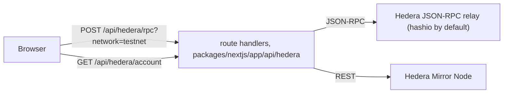

# Hardhat base for Scaffold-HBAR templates

A Hedera dApp starting point with one Solidity framework, Hardhat, and a Next.js frontend whose pages load with no configuration and without the browser calling any third-party host.
It is the blank template of Scaffold-HBAR as `create-scaffold-hbar` scaffolds it, minus its default keys, dead scripts and Foundry leftovers, plus the checks that keep it that way: repository checks for the docs and the manifest, a browser probe of every route, and a gate that scaffolds the template through the published CLI on every push.
It ships no product of its own: templates are built on top of it.

## Scaffold a project

```bash
npx create-scaffold-hbar@latest my-app --template OWNER/REPO -s hardhat
```

The same through npm's `create` command; the `--` is required, since without it the options go to npm, not to the CLI:

```bash
npm "create" scaffold-hbar@latest my-app -- --template OWNER/REPO -s hardhat
```

Replace `OWNER/REPO` with the GitHub repository that holds this template. The CLI installs the dependencies and makes the first commit. Then:

```bash
cd my-app
yarn dev    # http://localhost:3000
```

### Prerequisites

| Needed | Why |
| --- | --- |
| Node.js 20.18.3 or later | `engines` in `package.json` |
| git, with `user.name` and `user.email` set | the CLI commits the scaffold, and stops before creating anything when git has no identity |
| the default package manager on your `PATH`, any release from 1.0 | the CLI checks for it before scaffolding; the project then runs the release pinned in `package.json` (`packageManager`). GitHub's Ubuntu runners and the official Node.js container images already have it |

Foundry (`forge`) is not needed: every command here passes `-s hardhat`. No key, account or env file is needed to scaffold, lint, build, serve or test.

### Scaffolding notes

- Name the project in lowercase, as a single path segment. With `--yes` the CLI replaces a name it rejects, one with a capital letter for instance, by `my-hedera-dapp` and still exits 0.
- `--yes` accepts every default: the default package manager, and the Hedera Skills install, which adds agent skills under `.agents/`, `.claude/`, `agent/` and `skills-lock.json`. The repository checks and formatters leave those paths alone.
- To scaffold for npm, end the command with `--package-manager "npm"`. The CLI then rewrites the new project's docs and scripts for npm, commands included.
- Git Bash on Windows: when a `package.json` in a parent folder pins another package manager, Corepack refuses to run the default one outside a project, and the CLI reports it as not installed. Prefix the scaffold command with `COREPACK_ENABLE_STRICT=0`. Git Bash also turns an argument that starts with `/` into a Windows path: set `MSYS_NO_PATHCONV=1` before passing a route such as `/debug` to the scripts under `tools/`.

## Develop

```bash
yarn dev                        # development server on http://localhost:3000
```

The home page shows the connected wallet, a burner wallet unless you connect another, and `/debug` reads and writes the sample contracts deployed on Hedera testnet. With no env file both pages load, and on page load the browser talks to the app only: JSON-RPC goes through `/api/hedera/rpc` and account lookups through `/api/hedera/account`, two route handlers that answer HTTP 200 with a typed error body when the public Hedera endpoints behind them fail. A browser logs every HTTP response of 400 or more as a console error, which is why nothing third-party is called from the page.

Against a local fork of Hedera testnet:

```bash
yarn hardhat:chain              # terminal 1: the fork, JSON-RPC on http://127.0.0.1:8545
yarn hardhat:deploy:localhost   # terminal 2: deploy the sample contracts to it
yarn dev                        # terminal 3
```

On Hedera testnet, with a deployer account funded from the [Hedera Portal faucet](https://portal.hedera.com/faucet):

```bash
yarn hardhat:account:generate   # new key, stored encrypted in packages/hardhat/.env
yarn hardhat:account            # asks for the password, prints the address and its balances
yarn hardhat:deploy:testnet     # asks for the password, deploys, regenerates the frontend's contract list
```

Without a stored key the deploy stops with exit code 1 and names both ways to provide one. There is no fallback key: the upstream configuration fell back to Hardhat's well-known account #0, which is a funded account on Hedera testnet.

## Check a change

```bash
yarn lint:strict                # ESLint and Prettier on both packages, no warning allowed
yarn typecheck                  # both packages; compiles the contracts first
yarn build                      # production build of the frontend
yarn test                       # Hardhat tests on a fork of Hedera testnet (network needed)
yarn check:all                  # lint:strict, typecheck, the tools' tests, the docs checks
```

After `yarn build`, `yarn probe:routes` loads every page route in Chromium three times: third parties reachable, third parties failing at the network level, and third parties answering 429 then 400. A console error, a page error, or any request to a third-party host fails the route. It serves the build on port 3000 and stops the server afterwards.

`yarn gate:local` scaffolds the committed HEAD through the published CLI into a temporary folder, installs it, and runs `lint:strict`, `typecheck`, `build` and `test` in the new project, then boots it with no env file and requests every route. It needs well over 1 GB of disk while it runs. `.github/workflows/gate.yml` runs the same leg on every push to the template repository, then the route probe, the docs checks and a secret scan of the tree and the history.

## Scripts

| Script | What it does |
| --- | --- |
| `yarn dev` | development server, port 3000 |
| `yarn build` | production build of `packages/nextjs` |
| `yarn serve` | production server for that build, port 3000 (`next:start` is the development server, despite its name) |
| `yarn lint` | ESLint, with Prettier as a rule, on both packages |
| `yarn lint:strict` | the same, failing on any warning |
| `yarn format` | Prettier on both packages and on `tools/` |
| `yarn typecheck` | TypeScript on both packages, after compiling the contracts |
| `yarn test` | Hardhat tests |
| `yarn check:tools` | formatting of `tools/`, types of `tools/checks`, unit tests of `tools/checks` and `tools/gate` |
| `yarn check:docs` | the repository checks of `tools/checks`: docs, manifest, npm-mode rewrite, hygiene |
| `yarn check:all` | `lint:strict`, `typecheck`, `check:tools`, `probe:routes:check`, `check:docs` |
| `yarn probe:routes` | browser console probe of every route (after `build`) |
| `yarn probe:routes:check` | unit tests and types of the route probe |
| `yarn gate:local` | one gate leg against the committed HEAD |
| `yarn hardhat:chain` | local fork of Hedera testnet, port 8545 |
| `yarn hardhat:deploy:localhost` | deploy the sample contracts to that fork |
| `yarn hardhat:deploy:testnet` | deploy them to Hedera testnet |
| `yarn hardhat:account:generate` | create a deployer key, stored encrypted |
| `yarn hardhat:account:import` | import an existing key, stored encrypted |
| `yarn hardhat:account` | show the deployer address and its balances |

The other scripts run one step of one package and carry its prefix, `next:` or `hardhat:`.

## Environment variables

Nothing needs to be set: the app, the build and the tests run with no env file. Each variable goes in the file named below; a scaffolded project also gets a root `.env.example` listing them, but no package reads env files at the root.

| Variable | File | Required | Default | Read by |
| --- | --- | --- | --- | --- |
| `NEXT_PUBLIC_WALLET_CONNECT_PROJECT_ID` | `packages/nextjs/.env.local` | no | empty: WalletConnect is off, browser-injected and burner wallets are offered | `packages/nextjs/scaffold.config.ts` |
| `HEDERA_RPC_TESTNET_URL` | `packages/nextjs/.env.local` | no | `https://testnet.hashio.io/api` | the `/api/hedera/rpc` relay, on the server |
| `HEDERA_RPC_MAINNET_URL` | `packages/nextjs/.env.local` | no | `https://mainnet.hashio.io/api` | the same relay, for mainnet |
| `HEDERA_MIRROR_TESTNET_URL` | `packages/nextjs/.env.local` | no | `https://testnet.mirrornode.hedera.com` | the `/api/hedera/account` route, on the server |
| `HEDERA_MIRROR_MAINNET_URL` | `packages/nextjs/.env.local` | no | `https://mainnet.mirrornode.hedera.com` | the same route, for mainnet |
| `HEDERA_RPC_URL` | `packages/hardhat/.env` | no | `https://testnet.hashio.io/api` | the in-process Hardhat network, which forks it (`hardhat:chain`, `test`) |
| `DEPLOYER_PRIVATE_KEY_ENCRYPTED` | `packages/hardhat/.env` | for a live deploy | none; written by `hardhat:account:generate` or `hardhat:account:import` | the deploy script, which asks for its password |
| `__RUNTIME_DEPLOYER_PRIVATE_KEY` | never a file: the shell, for one command | no | none | `packages/hardhat/hardhat.config.ts`, the only key live networks sign with; the deploy script sets it from the encrypted key |

## Layout



- `packages/nextjs`: Next.js 15 with the App Router, RainbowKit 2.2.9, wagmi 2.19.5, viem 2.39.0 and the `@scaffold-hbar-ui` kit. Routes `/`, `/debug`, and the two route handlers above.
- `packages/hardhat`: Hardhat 2.22.19 with hardhat-deploy. Sample contracts `HederaToken`, an ERC-20, and `HtsTokenCreator`, which creates and mints an HTS token through the system contract at `0x167`. The tests run on a fork of Hedera testnet where `@hashgraph/system-contracts-forking` emulates the token service.
- `tools/checks`: the repository checks behind `check:docs`; `tools/route-probe`: the browser probe, a standalone package outside the workspaces, installed from its own lockfile by npm, so that no install of the app downloads a browser; `tools/gate`: the scaffold gate. Each has a README.
- `.github/workflows`: `gate.yml` in the template repository; `gate-skeleton.yml` and `hosts-control.yml`, which a guard limits to the public skeleton repository of this base; `lint.yaml` on pushes and pull requests to `main`.

## What this base does not do

- Nothing here has been deployed to, or tested against, Hedera mainnet. The mainnet network entry comes from the upstream scaffold, and the `hardhat:deploy:mainnet` alias that targets it has never been run.
- `yarn test` depends on a third party: the fork reads Hedera testnet through hashio, so a hashio outage fails the run.
- `hardhat:deploy` without a network uses the in-process network, which has no token-service emulation: the HTS step (`02_create_hts_token.ts`) stops with `invalid opcode`. Use `hardhat:chain` with `hardhat:deploy:localhost`.
- Only page load is checked for third-party calls. After user action, the UI kit's address input on `/debug` asks the public mirror node directly, and its write form logs a console error when a transaction fails.
- The `/api/hedera/rpc` relay forwards any `eth_`, `net_` or `web3_` call and adds no rate limit of its own: every visitor's calls leave from the server's address.
- No browser-wallet signature is part of any check here, and WalletConnect is off until a project id is set.
- The frontend has no unit tests; the route probe is its only automated check.
- This code is experimental and has not been audited.

## Licence and provenance

MIT, see `LICENCE`; the BuidlGuidl (Scaffold-ETH 2) and hedera-dev (Scaffold-HBAR) notices are kept above this template's own.
This base was scaffolded with `create-scaffold-hbar` 0.4.0 from the blank-template branch of hedera-dev/scaffold-hbar at commit 88c8837, with Hardhat selected and the skills install off. The `@x402/*` build guard in `packages/nextjs/next.config.ts` comes from that repository's main branch at commit 5eb46ef. `git log` lists every change made since, one commit per change.

<!-- checks:allow
paths: agent skills-lock.json
symbols: COREPACK_ENABLE_STRICT MSYS_NO_PATHCONV
-->
