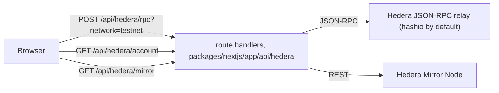

# Hardhat base for Scaffold-HBAR templates

A Hedera dApp starting point with one Solidity framework, Hardhat, and a Next.js frontend whose pages load with no configuration and without the browser calling any third-party host.
It is the blank template of Scaffold-HBAR as `create-scaffold-hbar` scaffolds it, minus its default keys, dead scripts and Foundry leftovers, plus the checks that keep it that way: repository checks for the docs and the manifest, a browser probe of every route, and a gate that scaffolds the template through the published CLI on pushes to `main` and every night.
It ships no product of its own: templates are built on top of it.

## Quick start

```bash
npx create-scaffold-hbar@latest my-app --template OWNER/REPO -s hardhat
```

The same through npm's `create` command; the `--` is required, since without it the options go to npm, not to the CLI:

```bash
npm "create" scaffold-hbar@latest my-app -- --template OWNER/REPO -s hardhat
```

Replace `OWNER/REPO` with the GitHub repository that holds this template. The CLI installs the dependencies and makes the first commit. Then:

```bash
cd my-app
yarn dev    # http://localhost:3000
```

## Prerequisites

| Needed | Why |
| --- | --- |
| Node.js 20.18.3 or later | `engines` in `package.json` |
| git, with `user.name` and `user.email` set | the CLI commits the scaffold, and stops before creating anything when git has no identity |
| the default package manager on your `PATH`, any release from 1.0 | the CLI checks for it before scaffolding; the project then runs the release pinned in `package.json` (`packageManager`). GitHub's Ubuntu runners and the official Node.js container images already have it |

Foundry (`forge`) is not needed: every command here passes `-s hardhat`. No key, account or env file is needed to scaffold, lint, build, serve or test.

## Scaffolding notes

- Name the project in lowercase, as a single path segment. With `--yes` the CLI replaces a name it rejects, one with a capital letter for instance, by `my-hedera-dapp` and still exits 0.
- `--yes` accepts every default: the default package manager, and the Hedera Skills install, which adds agent skills under `.agents/`, `.claude/`, `agent/` and `skills-lock.json`. The repository checks and formatters leave those paths alone.
- To scaffold for npm, end the command with `--package-manager "npm"`. The CLI then rewrites the new project's docs and scripts for npm, commands included.
- Git Bash on Windows: when a `package.json` in a parent folder pins another package manager, Corepack refuses to run the default one outside a project, and the CLI reports it as not installed. Prefix the scaffold command with `COREPACK_ENABLE_STRICT=0`. Git Bash also turns an argument that starts with `/` into a Windows path: prefix a command that passes a route such as `/debug` to a script under `tools/` with `MSYS_NO_PATHCONV=1`, rather than exporting it, since Corepack's shims need the conversion.

## Develop

```bash
yarn dev                        # development server on http://localhost:3000
```

The home page shows the connected wallet, a burner wallet unless you connect another, and `/debug` reads and writes the contracts listed in `packages/nextjs/contracts/deployedContracts.ts`. The Hedera testnet entries it ships with are the upstream scaffold's own deployments of the sample contracts, so an owner-only function such as `mint` reverts for you; every deploy rewrites the file from `packages/hardhat/deployments/`, and after `yarn hardhat:deploy:testnet` it lists your own. With no env file both pages load, and on page load the browser talks to the app only: JSON-RPC goes through `/api/hedera/rpc` and account lookups through `/api/hedera/account`, two route handlers that answer HTTP 200 with a typed error body when the public Hedera endpoints behind them fail, since a browser logs every response of 400 or more as a console error.

Against a local fork of Hedera testnet:

```bash
yarn hardhat:chain              # terminal 1: the fork, JSON-RPC on http://127.0.0.1:8545
yarn hardhat:deploy:localhost   # terminal 2: deploy the sample contracts to it
yarn dev                        # terminal 3
```

On Hedera testnet, with a deployer account funded from the [Hedera Portal faucet](https://portal.hedera.com/faucet):

```bash
yarn hardhat:account:generate   # new key, stored encrypted in packages/hardhat/.env
yarn hardhat:account            # asks for the password, prints the address and its balances
yarn hardhat:deploy:testnet     # asks for the password, deploys, regenerates the frontend's contract list
```

Without a stored key the deploy stops with exit code 1 and names both ways to provide one. There is no fallback key: the upstream configuration fell back to Hardhat's well-known account #0, which is a funded account on Hedera testnet.

## Using the swap route

`/swap` swaps HBAR for an HTS token and the token back to HBAR on SaucerSwap V2, on Hedera testnet. It needs no deployment of your own and no env file: a browser wallet holding a little testnet HBAR is enough.

On Hedera a swap can pass `eth_call`, `eth_estimateGas` and the mirror node's own simulator and still be rejected by the network, which keeps the gas, while the wallet shows a fee, a Confirm button and no warning at all. `docs/hedera-behaviour.md` has those transactions, what the mistake cost and the code that avoids it. This route is that code in front of a person.

What the page does, in the order it shows it:

1. **Connect.** It reads and sends through a browser wallet only, on chain 296. On another chain it offers one button, which switches the wallet and adds Hedera testnet to it when it is missing. Connected with the burner wallet — which connects by itself on a first visit — it reads nothing and sends nothing, and says why: that key lives in the browser, and every transaction here is a real one on a live network.
2. **Your account**, from the mirror node through `/api/hedera/mirror`: the Hedera account id, the HBAR, the token balance, the allowance given to the SaucerSwap router, whether the account is associated with the token, and how many automatic association slots it has. Every line is something a swap depends on.
3. **The form**: the direction, the amount, and how far the price may move before the swap is refused. Nothing is asked of the network until the quote button is pressed, so loading the route makes no request outside the app's own origin at all — which `yarn probe:routes` checks in three network modes, the harshest of them answering every third-party host 429 and then 400.
4. **Before the wallet opens**: the quote, the least output you accept, and one line per check the network would otherwise answer only after taking the gas. Each line is one sentence and, when the page can act on it, a button: a missing allowance offers to approve exactly the amount of the swap. A blocked line blocks the send.
5. **The cost preview**, from `estimateContractGas` for this sender and these arguments, always said as "up to", with the line that explains why the wallet will announce more: a wallet prices the gas limit at the current gas price, and the network charges the gas the call really uses.
6. **The send and what happened.** The call reaches the wallet with its value already in weibar and, for a call no simulator prices, with the gas limit of a rule in `packages/nextjs/lib/hedera/gasRules.ts`. The outcome is then read from the mirror node's DETAIL view rather than from the receipt: on a failure the page fetches the transaction's `/actions` view, where the reason survives that SaucerSwap's `multicall` erased, and shows one sentence, the action to take, and both links — the mirror node's, which any checker can read, and Hashscan's, which renders it for a person.

What it refuses, and why:

| It refuses | Because |
| --- | --- |
| a token-input swap while the router's allowance is below the amount | all three simulators accept that swap and the network rejects it with `SPENDER_DOES_NOT_HAVE_ALLOWANCE`, having already charged the gas. One keyless read of the allowance costs nothing and prevents it |
| an HBAR-input swap to an account not associated with the token and with no automatic association slot | the token cannot arrive, so the swap reverts and is still charged |
| a swap after an approval whose HTS return value is not success | an HTS operation can fail inside a transaction the network reports as a success, so the receipt alone never says whether it happened |
| an amount of zero, an amount larger than an HTS amount can be, or a slippage that leaves a minimum output of zero | a swap with no minimum accepts any price it is given, and an amount the router cannot carry fails at the token service |
| a send on a quote more than a minute old | the price moves, and the minimum output was computed from a price nobody has looked at since |
| a call neither simulator will price, without a gas limit from the page | a wallet that cannot price a call refuses to send it, and the limits, with the executed transactions each one comes from, live in `packages/nextjs/lib/hedera/gasRules.ts` |
| anything at all, before it says so on the page | no failure on this route reaches the browser console: every one of them renders as a sentence with its action |

The route is testnet-only. Every address it calls comes from `packages/nextjs/lib/hedera/addresses.ts`, every check and every message from `packages/nextjs/lib/hedera`, and it never asks for a key: the wallet signs.

## Check a change

```bash
yarn lint:strict                # ESLint and Prettier on both packages, no warning allowed
yarn typecheck                  # both packages; compiles the contracts first
yarn test:unit                  # unit tests of the frontend's Hedera library, no network and no key
yarn build                      # production build of the frontend
yarn test                       # Hardhat tests on a fork of Hedera testnet (network needed)
yarn check:all                  # lint:strict, typecheck, the tools' tests, the docs checks (registry needed)
```

`yarn check:all` needs the package registry, like `yarn test` needs hashio: it reinstalls the route probe from its lockfile, and two docs checks download the published CLI to replay its npm-mode rewrite and its manifest schema.

After `yarn build`, `yarn probe:routes` loads every page route in Chromium three times: third parties reachable, third parties failing at the network level, and third parties answering 429 then 400. A console error, a page error, or any request to a third-party host fails the route. It serves the build on port 3000 and stops the server afterwards.

`yarn gate:local` scaffolds the committed HEAD through the published CLI into a temporary folder, installs it, and runs `lint:strict`, `typecheck`, `build` and `test` in the new project, then boots it with no env file and requests every route. It needs well over 1 GB of disk while it runs. `.github/workflows/gate.yml` runs the same leg on every push to `main` of the template repository that changes more than Markdown, and nightly, with a failed `test` reported but not blocking since it depends on hashio; then the route probe, the docs checks and a secret scan of the tree and the history.

## Live checks and testnet evidence

```bash
yarn check:live                 # keyless reads of Hedera testnet, then evidence:check (network needed)
yarn evidence:check             # re-reads every file of docs/evidence/ from the mirror node, no key
yarn evidence                   # signs two swaps on Hedera testnet and writes docs/evidence/
```

`yarn check:live` needs no key and nothing but network access to hashio and the testnet mirror node, which are third parties: a failure can be theirs, so run it again before you debug. It checks that every entry of the address book in `packages/nextjs/lib/hedera/addresses.ts` has code, that the SwapRouter's `factory()`, `whbar()` and `WHBAR()` and the factory's `getPool` for WHBAR, SAUCE and the 0.30 % fee agree with it, that the router and QuoterV2 are still associated with WHBAR and SAUCE, and that QuoterV2 quotes 1 HBAR for SAUCE. It also re-asserts a dated observation: on Hedera testnet (relay/0.78.5, 22 Sept 2026) `eth_call`, `eth_estimateGas` and the mirror node's own simulator all accept a SAUCE to HBAR swap from an account that has given the router no allowance. It simulates from 0.0.10650089, a testnet account of this project's research phase that holds SAUCE, has never approved a spender and signs nothing, and a control swap for more SAUCE than that account holds must still be refused. The day a simulator refuses the swap, the check fails: the observation has ended. If that account's state changes instead (an allowance, or less than 1 SAUCE), the check fails before simulating and says that the account no longer fits, not the platform or the code. `.github/workflows/gate.yml` runs `check:live` inside the scaffolded project on its nightly and manual runs, writes the outcome to the job summary, and never fails the run on it.

`yarn evidence` signs with `__RUNTIME_DEPLOYER_PRIVATE_KEY`, set in the shell for this one command and never written to a file; without it both swaps are skipped with that message and the command exits 0. The key has to be an ECDSA key, and its account has to meet three conditions. Its EVM address is the one the key derives: the run looks the account up by that address and stops before signing when no account has it. It holds a few HBAR (the [Hedera Portal faucet](https://portal.hedera.com/faucet) funds one). And it is associated with SAUCE or has a free automatic association slot, since the first swap delivers SAUCE to it; the recipient check says which before anything is signed. In bash (Git Bash on Windows):

```bash
read -rs __RUNTIME_DEPLOYER_PRIVATE_KEY   # paste the key: it is not echoed, and not kept in the history
export __RUNTIME_DEPLOYER_PRIVATE_KEY
yarn evidence
unset __RUNTIME_DEPLOYER_PRIVATE_KEY
```

It stops before signing when the JSON-RPC relay does not serve chain 296, and it refuses any send that could take the run above 5 HBAR. Then it swaps 0.1 HBAR for SAUCE, and 1 SAUCE back to native HBAR, through `packages/nextjs/lib/hedera`: quote, pre-flight checks (recipient, allowance, cost preview), builders, viem's default flow on the pinned 2.39.0, the outcome read from the mirror node's DETAIL view. When the allowance check fails it first approves exactly 1 SAUCE and checks that the approval returned `true`. Each record is re-checked the way `yarn evidence:check` does before it is written to `docs/evidence/`, one file per scenario, named after the date and the scenario.

<!-- checks:evidence -->
What one run cost, measured on 22 Sept 2026 through relay/0.78.5 with viem 2.39.0 (`docs/evidence/2026-09-22-hbar-to-sauce.json` and `docs/evidence/2026-09-22-sauce-to-hbar.json`):

| transaction | network fee | cost preview shown before signing | outcome |
| --- | --- | --- | --- |
| swap 0.1 HBAR for SAUCE | 0.21804796 HBAR | up to 0.24452658 HBAR | 4.643294 SAUCE |
| approve 1 SAUCE for the router | 0.79222944 HBAR | up to 0.8921298 HBAR | returned `true` |
| swap 1 SAUCE for HBAR | 0.99717124 HBAR | up to 1.10563584 HBAR | 0.0214075 HBAR, native |

2.00744864 HBAR of fees in all; the account's HBAR balance fell by 2.08604114 HBAR, the fees plus the 0.1 HBAR swapped minus the 0.0214075 HBAR received.
<!-- /checks:evidence -->

On testnet a 1 SAUCE swap returns far less HBAR than it costs: the cost check says so before signing, and the run goes on. `yarn check:docs` compares every figure above with the files it names, and fails once a newer record of either scenario exists.

Each file holds no key and nothing private: the scenario's `name`, `network` and `chainId`; the sender's EVM address and account id, both public on the network; the versions of viem, of the relay (its `web3_clientVersion`) and of Node.js; what each pre-flight check said; the input parameters (router, pool and fee tier, tokens, `amountIn`, `quotedAmountOut`, `slippageBps`, `amountOutMinimum`, `deadline`, `recipient`) and the `amountOut` the swap returned; and per transaction its `hash`, its `mirrorUrl` (the mirror node's DETAIL view), `result`, `consensusTimestamp`, `blockNumber`, `gasUsed`, the cost preview, the fee read from the transaction record's HBAR transfer list and the sender's net HBAR movement. Amounts are integers in the smallest unit (tinybar for HBAR, 10^-6 for SAUCE).

To verify a file without a key, run `yarn evidence:check`, or open its `mirrorUrl` values: `result` must be `SUCCESS`. The check re-reads each transaction from the mirror node and fails on any difference: the result; the sender, which the mirror node names by the long-zero form of its account and the check resolves to the recorded EVM address; the block, the gas used, the fee and the sender's net HBAR movement from the transfer list; the approval's return value; and the swap's `amountOut`, decoded from its `call_result`.

`docs/hedera-behaviour.md` is what these checks exist for: the two behaviours standard tooling reports wrongly or not at all, each with the testnet transactions that prove it, what the mistake costs in HBAR, the code that refuses it and the test that keeps that code honest.

## Working with a coding agent

`AGENTS.md` is the briefing for coding agents: the commands, the checks to run before stopping, the invariants a change has to keep, and what to ask about first. Claude Code reads it through `CLAUDE.md`.

## Scripts

| Script | What it does |
| --- | --- |
| `yarn dev` | development server, port 3000 |
| `yarn build` | production build of `packages/nextjs` |
| `yarn serve` | production server for that build, port 3000 (`next:start` is the development server, despite its name) |
| `yarn lint` | ESLint, with Prettier as a rule, on both packages |
| `yarn lint:strict` | the same, failing on any warning |
| `yarn format` | Prettier on both packages and on `tools/` |
| `yarn typecheck` | TypeScript on both packages, after compiling the contracts |
| `yarn test` | Hardhat tests |
| `yarn test:unit` | Vitest tests of `packages/nextjs/lib/hedera`, of the mirror relay and of the swap route's own logic, on captured testnet answers |
| `yarn check:tools` | formatting of `tools/`, types and unit tests of `tools/checks` and `tools/gate` |
| `yarn check:docs` | the repository checks of `tools/checks`: docs, manifest, npm-mode rewrite, evidence figures, hygiene |
| `yarn check:all` | `lint:strict`, `typecheck`, `check:tools`, `probe:routes:check`, `check:docs` |
| `yarn check:live` | keyless reads of Hedera testnet: the address book, a quote, a dated simulator observation, then `evidence:check` |
| `yarn evidence:check` | re-reads every file of `docs/evidence/` from the mirror node, without a key |
| `yarn evidence` | signs two swaps on Hedera testnet and writes `docs/evidence/`; needs `__RUNTIME_DEPLOYER_PRIVATE_KEY`, skipped without it |
| `yarn probe:routes` | browser console probe of every route (after `build`) |
| `yarn probe:routes:check` | unit tests and types of the route probe |
| `yarn gate:local` | one gate leg against the committed HEAD |
| `yarn hardhat:chain` | local fork of Hedera testnet, port 8545 |
| `yarn hardhat:deploy:localhost` | deploy the sample contracts to that fork |
| `yarn hardhat:deploy:testnet` | deploy them to Hedera testnet |
| `yarn hardhat:account:generate` | create a deployer key, stored encrypted |
| `yarn hardhat:account:import` | import an existing key, stored encrypted |
| `yarn hardhat:account` | show the deployer address and its balances |

The other scripts run one step of one package and carry its prefix, `next:` or `hardhat:`.

## Environment variables

Nothing needs to be set: the app, the build and the tests run with no env file. Each variable goes in the file named below; a scaffolded project also gets a root `.env.example` listing them, but no package reads env files at the root.

| Variable | File | Required | Default | Read by |
| --- | --- | --- | --- | --- |
| `NEXT_PUBLIC_WALLET_CONNECT_PROJECT_ID` | `packages/nextjs/.env.local` | no | empty: WalletConnect is off, browser-injected and burner wallets are offered | `packages/nextjs/scaffold.config.ts` |
| `HEDERA_RPC_TESTNET_URL` | `packages/nextjs/.env.local` | no | `https://testnet.hashio.io/api` | the `/api/hedera/rpc` relay, on the server |
| `HEDERA_RPC_MAINNET_URL` | `packages/nextjs/.env.local` | no | `https://mainnet.hashio.io/api` | the same relay, for mainnet |
| `HEDERA_MIRROR_TESTNET_URL` | `packages/nextjs/.env.local` | no | `https://testnet.mirrornode.hedera.com` | the `/api/hedera/account` and `/api/hedera/mirror` routes, on the server |
| `HEDERA_MIRROR_MAINNET_URL` | `packages/nextjs/.env.local` | no | `https://mainnet.mirrornode.hedera.com` | the same routes, for mainnet |
| `HEDERA_RPC_URL` | `packages/hardhat/.env` | no | `https://testnet.hashio.io/api` | the in-process Hardhat network, which forks it (`hardhat:chain`, `test`) |
| `DEPLOYER_PRIVATE_KEY_ENCRYPTED` | `packages/hardhat/.env` | for a live deploy | none; written by `hardhat:account:generate` or `hardhat:account:import` | the deploy script, which asks for its password |
| `__RUNTIME_DEPLOYER_PRIVATE_KEY` | never a file: the shell, for one command | no | none | `packages/hardhat/hardhat.config.ts`, the only key live networks sign with; the deploy script sets it from the encrypted key; `yarn evidence` signs with it and is skipped without it |

## Architecture



- `packages/nextjs`: Next.js 15 with the app directory, RainbowKit 2.2.9, wagmi 2.19.5, viem 2.39.0 and the `@scaffold-hbar-ui` kit. Routes `/`, `/debug`, and the three route handlers above. `packages/nextjs/lib/hedera` holds the Hedera-specific code the app and scripts share: units, addresses, ABIs, error decoding, the mirror client and the checks run before a transaction is signed. It types every address as `EvmAddress`, `0x${string}`, in every project it is scaffolded into; an address that reaches your code as a plain string goes through its `toEvmAddress`, which returns the checksummed form and refuses anything that is not an address. viem's own address type still depends on the package manager that installed the project, so an address you take straight from viem or wagmi compiles into the library in one project and not in the other: `toEvmAddress` is the door that compiles in both.
- `packages/hardhat`: Hardhat 2.22.19 with hardhat-deploy. Sample contracts `HederaToken`, an ERC-20, and `HtsTokenCreator`, which creates and mints an HTS token through the system contract at `0x167`. The tests run on a fork of Hedera testnet where `@hashgraph/system-contracts-forking` emulates the token service.
- `tools/checks`: the repository checks behind `check:docs`; `tools/route-probe`: the browser probe, a standalone package outside the workspaces, installed from its own lockfile by npm, so that no install of the app downloads a browser; `tools/gate`: the scaffold gate. Each has a README.
- `.github/workflows`: `gate.yml` in the template repository; `gate-skeleton.yml` and `hosts-control.yml`, which a guard limits to the public skeleton repository of this base; `lint.yaml` on pushes and pull requests to `main`: `lint:strict`, `typecheck`, `test:unit`, `check:tools`, `probe:routes:check` and ShellCheck on `tools/gate`.

## What this base does not do

- Nothing here has been deployed to, or tested against, Hedera mainnet. The mainnet network entry comes from the upstream scaffold, and the `hardhat:deploy:mainnet` alias that targets it has never been run.
- `yarn test` depends on a third party: the fork reads Hedera testnet through hashio, so a hashio outage fails the run.
- `hardhat:deploy` without a network uses the in-process network, which has no token-service emulation: the HTS step (`02_create_hts_token.ts`) stops with `invalid opcode`. Use `hardhat:chain` with `hardhat:deploy:localhost`.
- Only page load is checked for third-party calls. After user action, the UI kit's address input on `/debug` asks the public mirror node directly, and its write form logs a console error when a transaction fails.
- The `/api/hedera/rpc` relay forwards any `eth_`, `net_` or `web3_` call and adds no rate limit of its own: every visitor's calls leave from the server's address.
- No browser-wallet signature is part of any check here, and WalletConnect is off until a project id is set.
- The unit tests cover `packages/nextjs/lib/hedera`, the mirror relay and the parts of the swap route that need no browser; what a page renders is checked by the route probe alone.
- This code is experimental and has not been audited.

## Licence and provenance

MIT, see `LICENCE`; the BuidlGuidl (Scaffold-ETH 2) and hedera-dev (Scaffold-HBAR) notices are kept above this template's own.
This base was scaffolded with `create-scaffold-hbar` 0.4.0 from the blank-template branch of hedera-dev/scaffold-hbar at commit 88c8837, with Hardhat selected and the skills install off. The `@x402/*` build guard in `packages/nextjs/next.config.ts` comes from that repository's main branch at commit 5eb46ef. `git log` lists every change made since, one commit per change.

<!-- checks:allow
paths: agent skills-lock.json
symbols: COREPACK_ENABLE_STRICT MSYS_NO_PATHCONV
-->
